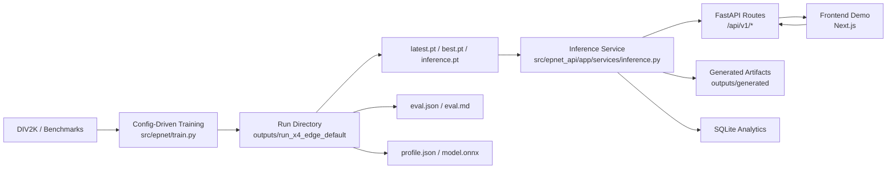

# EPNet Presentation Master Guide

This document is the presentation master source for the EPNet repository in its
current real-data, deployment-integrated state. It is intentionally much more
detailed than the README and is designed to serve four purposes at once:

1. slide-deck source material
2. code and system understanding guide
3. presentation preparation guide
4. interview/demo narrative document

The content below is based on the actual repository state, actual configs,
actual scripts, actual trained artifacts, and actual current outputs in this
workspace. It does **not** describe a generic EPNet implementation detached
from the repository.

---

## 1. Executive Summary

This project is a complete single-image super-resolution system built around an
EPNet-style architecture. It started as a paper-grounded model implementation
and was extended into a full technical product artifact with:

- real-data training on DIV2K
- benchmark evaluation on Set5, Set14, BSD100, and Urban100
- resumable checkpointing and inference-ready artifact export
- ONNX export smoke validation
- a FastAPI inference backend
- a Next.js frontend demo
- runtime artifact selection, analytics, history replay, and model explanation UI

The final system solves a more practical problem than “can EPNet be implemented
in PyTorch?” It answers:

- can the model be trained on real data?
- can it be resumed locally on MPS/CUDA/CPU?
- can it be evaluated reproducibly?
- can it be exported?
- can it become a usable deployed inference service?
- can it be demonstrated end to end in a presentation?

The most important positioning point for a presentation is this:

> This repository is not only a paper reproduction. It is a research-to-system
> bridge that turns an EPNet-inspired model into a trainable, evaluable,
> exportable, and deployable image enhancement product demo.

---

## 2. Project Scope and Positioning

This repository is an EPNet-based super-resolution project. In its final state,
it includes all of the following:

- model implementation
- preset management
- real-data training
- synthetic smoke/regression training
- evaluation
- profiling
- ONNX export smoke path
- deployment configuration
- backend/API serving
- frontend demonstration

It therefore sits at the intersection of:

- model engineering
- experiment reproducibility
- deployment engineering
- product demonstration

This is important for framing:

- It is more than a paper summary.
- It is more than a model checkpoint.
- It is more than a frontend demo.
- It is a cohesive ML system with a real trained artifact.

End-to-end, the final system can:

1. train EPNet on real DIV2K data
2. resume from checkpoints automatically
3. evaluate on standard SR benchmarks
4. export an ONNX artifact
5. serve a trained inference checkpoint through FastAPI
6. accept image uploads from a frontend
7. return generated image artifacts and runtime metadata
8. track analytics and replay request history

---

## 3. Problem Statement

Single-image super-resolution (SISR) takes one low-resolution image and predicts
a higher-resolution version of that same image.

Why the problem matters:

- low-resolution inputs are common in surveillance, embedded cameras, mobile
  capture, document imaging, remote sensing, and legacy media
- in many real applications, downstream tasks depend on visual clarity:
  inspection, OCR, monitoring, and human review
- the challenge is not just producing “larger” images, but reconstructing
  plausible high-frequency detail while avoiding excessive artifacts

Why quality alone is not enough:

- a model may achieve strong metrics but still be too large to deploy
- a model may be fast in a notebook but hard to package into a real service
- a model may export poorly to deployment formats
- a model may lack reproducible training and evaluation artifacts

That is why this repository is framed as a complete solution:

- the model is important
- the training pipeline is important
- the evaluation protocol is important
- the deployment path is important
- the system integration path is important

For a technical presentation, this broader framing is a strength: it shows
ownership across the full ML system lifecycle rather than only the network
architecture.

---

## 4. Why This Project Was Built

The project motivation evolved in two stages.

### Stage 1: paper-grounded implementation

The starting point was the EPNet paper:

- PFEM + ESPM
- efficient SR architecture
- explicit interest in balancing quality with lower computational cost

EPNet is a good starting point because it is not only about maximizing quality.
Its framing already cares about computational efficiency, which makes it a good
candidate for deployment-oriented system work.

### Stage 2: deployment-oriented systemization

The repository then moved beyond pure reproduction toward a more realistic
engineering goal:

- preserve the EPNet design spirit
- document paper ambiguities explicitly
- train on real data
- expose artifacts and evaluation
- deploy the trained model into a usable system

This shift matters in interviews and demos because it shows an engineering
mindset:

- not just “I implemented the model”
- but “I turned the model into a usable product-style system”

---

## 5. EPNet in Plain Product Language

This section is useful for slides aimed at non-specialists or mixed audiences.

### Detail-focused branch

One branch focuses on enriching local image details. This is the part that tries
to recover texture, edges, and local image structure that gets lost in a
low-resolution image.

### Pyramid/context branch

Another branch captures broader structure at multiple scales. This helps the
model understand larger spatial context rather than only local patches.

### Reconstruction head

The two branches are fused and converted into the final super-resolved image
through a lightweight reconstruction stage.

### Why this framing works

It is easier to explain than immediately starting with PFEM/ESPM/DCAB jargon.

Presentation-friendly wording:

- “detail enhancement branch”
- “pyramid context branch”
- “multi-stage feature fusion”
- “reconstruction head”

This framing is technically correct while remaining accessible.

---

## 6. EPNet in Technical / Paper Language

In paper language, the architecture is described through the following modules.

### PFEM

PFEM stands for **Panoramic Feature Extraction Module**.

In this repository, PFEM is implemented as a repeated stage that combines:

- LFEB
- a global-context block
- ESAB

Main file:

- `src/epnet/models/blocks/pfem.py`

### ESPM

ESPM stands for **Edge Split Pyramid Module**.

It is the lightweight pyramid-style branch that builds multi-scale context.

Main file:

- `src/epnet/models/blocks/espm.py`

### DCAB

DCAB stands for **Dynamic Channel Attention Block**.

It performs channel splitting, separate processing, channel attention, and
recombination. It is one of the main mechanisms inside ESPM.

Main file:

- `src/epnet/models/blocks/dcab.py`

### LFEB

LFEB stands for **Local Feature Extraction Block**.

It captures local information at the beginning of each PFEM stage.

Main file:

- `src/epnet/models/blocks/lfeb.py`

### ESAB

ESAB stands for **Enhanced Spatial Attention Block**.

It emphasizes salient spatial regions after local and global/context processing.

Main file:

- `src/epnet/models/blocks/esab.py`

### Global context / transformer-like module

The paper refers to a modified Swin Transformer inside PFEM.

In this repository, that idea is implemented through a pluggable global-context
block with these options:

- `swin`
- `lightweight_conv_context`
- `none`

The default mainline preset uses:

- `global_context: swin`

Main file:

- `src/epnet/models/blocks/global_context.py`

### Reconstruction / PixelShuffle

The final head:

- fuses PFEM and ESPM outputs
- projects them with convolution
- upsamples through `PixelShuffle`

Main file:

- `src/epnet/models/epnet.py`

---

## 7. Paper-to-Code Mapping

This section maps the paper concepts directly to the repository.

### Top-level EPNet

Paper concept:

- shallow stem
- PFEM branch
- ESPM branch
- fusion
- reconstruction

Code:

- `src/epnet/models/epnet.py`

### PFEM and its internals

Paper concept:

- repeated feature extraction stages
- local + global + spatial-attention refinement

Code:

- `src/epnet/models/blocks/pfem.py`
- `src/epnet/models/blocks/lfeb.py`
- `src/epnet/models/blocks/global_context.py`
- `src/epnet/models/blocks/esab.py`

### ESPM and DCAB

Paper concept:

- edge split pyramid branch
- dynamic channel splitting and fusion

Code:

- `src/epnet/models/blocks/espm.py`
- `src/epnet/models/blocks/dcab.py`

### Presets and engineering variants

Paper concept:

- the paper gives a target architecture idea and PFEM count recommendation

Code:

- `src/epnet/models/presets.py`
- `src/epnet/config.py`
- `src/epnet/models/registry.py`

### Where the implementation is faithful

- top-level two-branch structure
- shallow convolution stem
- PFEM-style repeated stages
- ESPM branch with DCAB logic
- reconstruction via convolution + PixelShuffle
- x2/x3/x4 support

### Where the implementation is an approximation

- the paper does not fully specify every engineering detail
- metric protocol details are not fully explicit
- global-context implementation is a repository-specific practical variant of
  the modified Swin-style idea
- deployment-oriented abstractions such as presets and export are engineering
  additions

### Where the implementation is adapted for engineering/deployment

- config-driven training/evaluation/export
- `edge_default` deployment-oriented preset
- synthetic smoke path
- ONNX export path
- inference artifact selection
- backend/frontend integration

Reference doc:

- `docs/paper_to_code_map.md`

---

## 8. Architecture Walkthrough

This is one of the most important sections for a presentation.

### 8.1 Input

The model receives a low-resolution RGB image tensor shaped like:

- `[B, 3, H, W]`

For deployment, this comes from:

- a PIL image decoded from uploaded bytes
- converted to a float tensor in `[0, 1]`

### 8.2 Shallow feature extraction

The first stage is a shallow `3x3` convolution.

Purpose:

- move from raw RGB pixels to a learned feature space
- create a shared representation that both PFEM and ESPM can consume

Code:

- `src/epnet/models/epnet.py`

### 8.3 PFEM branch

The PFEM branch is the detail-enrichment path.

In the current mainline preset (`edge_default`):

- `embed_dim = 40`
- `num_pfem = 2`
- `num_heads = 4`
- `window_size = 8`
- `global_context = "swin"`

Each PFEM stage does:

1. LFEB for local feature extraction
2. global context modeling
3. ESAB for spatial attention refinement

Conceptually:

- LFEB handles local texture/detail
- the context block broadens the receptive field
- ESAB re-weights salient spatial regions

### 8.4 ESPM branch

The ESPM branch runs in parallel from the shallow features.

Its job is to capture efficient multiscale structure.

In the current mainline preset:

- `espm_levels = 2`
- `split_ratio = 0.5`

The DCAB substructure splits channels, processes them differently, uses channel
attention, then fuses them back together.

Conceptually:

- PFEM is the richer branch
- ESPM is the lower-cost structural branch

### 8.5 Fusion

The outputs of the PFEM side and the ESPM side are fused.

Conceptually:

- detail features from PFEM
- broader context features from ESPM
- combined into one representation for reconstruction

### 8.6 Reconstruction

The reconstruction head:

1. applies a convolution to map features into a PixelShuffle-ready tensor
2. upsamples to the target resolution

For x4:

- input shape: `[B, 3, H, W]`
- output shape: `[B, 3, 4H, 4W]`

### 8.7 Why each stage matters

- shallow stem:
  simple, low-cost entry into feature space
- PFEM:
  higher-quality branch for detail refinement
- ESPM:
  efficient multi-scale structure branch
- fusion:
  joins complementary information
- reconstruction head:
  turns learned features into the final image

### 8.8 What to say verbally

Recommended verbal explanation:

> “The model starts by extracting a shallow feature map, then it runs two
> complementary paths in parallel. PFEM is the richer detail branch that mixes
> local extraction, attention, and transformer-style context. ESPM is the
> efficient pyramid branch that captures broader structure with less overhead.
> Those two branches are fused, then a lightweight reconstruction head and
> PixelShuffle produce the final high-resolution image.”

---

## 9. Preset Design

The repository includes four important preset families.

### `paper_like`

Role:

- closest baseline to the paper-grounded structure

Typical use:

- baseline comparison
- discussions about paper faithfulness

Current x4 config intent:

- preserve the paper-style architecture flavor
- not the default deployment model

### `edge_tiny`

Role:

- smallest edge-oriented preset

Typical use:

- smoke tests
- constrained experiments
- fast profiling

### `edge_default`

Role:

- repository mainline preset
- current deployed x4 model

Actual config from `configs/model/edge_default.yaml` and manifest:

| Field | Value |
|---|---:|
| upscale | 4 |
| embed_dim | 40 |
| num_pfem | 2 |
| window_size | 8 |
| num_heads | 4 |
| mlp_ratio | 2.0 |
| espm_levels | 2 |
| split_ratio | 0.5 |
| share_pfem_weights | false |
| global_context | swin |

Why it became the mainline:

- the repository’s local engineering experiments indicated that lower PFEM
  depth and lower ESPM depth gave a stronger practical quality/efficiency
  trade-off for this product-oriented system
- it preserved the EPNet design spirit while becoming easier to deploy

### `balanced_quality`

Role:

- larger local comparison point when quality matters more than speed

### Presentation framing

The most important message is:

> `paper_like` is the research baseline; `edge_default` is the deployed system
> choice.

That is a mature engineering decision, not a deviation to hide.

---

## 10. Data Pipeline

The repository has two data paths:

1. synthetic smoke path
2. real-data mainline path

### 10.1 Synthetic smoke path

Purpose:

- CI-friendly regression path
- fast sanity checks
- no claim of benchmark validity

Config:

- `configs/data/synthetic_x2.yaml`

Code:

- `src/epnet/data/synthetic.py`
- `src/epnet/data/datamodule.py`

### 10.2 Real-data path

Mainline training dataset:

- DIV2K training HR images

Actual training path from manifest:

- `data/raw/DIV2K/DIV2K_train_HR`

Validation source path from manifest:

- `data/raw/DIV2K/DIV2K_valid_HR`

Benchmark datasets currently prepared:

- Set5
- Set14
- BSD100
- Urban100

Manual benchmark path:

- Manga109

### 10.3 Bicubic cache generation

The repository generates bicubic low-resolution caches for x2/x3/x4.

Why:

- reproducible paired loading
- avoid regenerating LR images repeatedly during training/evaluation

Prepared directories referenced in earlier run reports:

- `data/processed/DIV2K_train_LR_bicubic`
- `data/processed/DIV2K_valid_LR_bicubic`
- `data/processed/benchmarks/<dataset>/LR_bicubic`

### 10.4 Path structure

Expected structure:

```text
data/
  raw/
    DIV2K/
      DIV2K_train_HR/
      DIV2K_valid_HR/
  processed/
    DIV2K_train_LR_bicubic/
    DIV2K_valid_LR_bicubic/
  benchmarks/
    Set5/HR/
    Set14/HR/
    BSD100/HR/
    Urban100/HR/
    Manga109/HR/   # manual
```

### 10.5 Data preparation scripts

- `scripts/download_real_data.py`
- `scripts/prepare_real_data.py`

### 10.6 Data flow into train/eval

Training:

- HR images discovered from DIV2K
- paired HR/LR crops loaded through dataset classes
- random HR crops determined by `patch_size`
- LR crops derived from scale

Evaluation:

- benchmark HR images
- corresponding bicubic LR inputs
- per-image prediction
- PSNR/SSIM aggregation

---

## 11. Training Workflow

The repository uses a config-driven training design.

### 11.1 Core training entrypoint

Primary file:

- `src/epnet/train.py`

### 11.2 Mainline x4 full training script

Actual script:

- `scripts/run_local_full_x4.py`

Actual config stack:

- model config: `configs/model/edge_default.yaml`
- data config: `configs/data/div2k_x4.yaml`
- train config: `configs/train/local_full_x4.yaml`

### 11.3 Actual mainline training config

From `configs/train/local_full_x4.yaml` and manifest:

| Field | Value |
|---|---:|
| scale | 4 |
| patch_size | 48 |
| batch_size | 4 |
| learning_rate | 5e-4 |
| betas | (0.9, 0.99) |
| ema_decay | 0.999 |
| total_steps | 100000 |
| save_every | 100 |
| log_every | 25 |
| val_every | 100 |
| max_validation_images | 8 |
| num_workers | 2 |
| device | auto |
| amp | auto |
| auto_resume | true |

### 11.4 Resume logic

The full run automatically resumes from:

- `outputs/run_x4_edge_default/latest.pt`

This is a crucial practical feature because long runs on local MPS or desktop
hardware are rarely completed in one uninterrupted session.

### 11.5 Checkpoint structure

The run directory contains:

- `latest.pt`
- `best.pt`
- periodic snapshots like `step99900.pt`, `step100000.pt`
- `inference.pt`

The three most important checkpoint types are:

- `latest.pt`
  - most recent training state
  - includes optimizer/resume state
- `best.pt`
  - best in-training validation checkpoint
  - selected by validation PSNR
- `inference.pt`
  - deployment-oriented export artifact
  - lighter runtime artifact used by the API

### 11.6 Output directory structure

Current mainline run:

- `outputs/run_x4_edge_default/`

Contains:

- `manifest.json`
- `train_log.jsonl`
- `latest.pt`
- `best.pt`
- `inference.pt`
- `step99900.pt`
- `step100000.pt`
- `eval.json`
- `eval.md`
- `profile.json`
- `profile.md`
- `model.onnx`
- `final_summary.json`

### 11.7 Actual training completion state

This run has completed the configured full schedule.

Actual final step:

- `100000`

Actual best validation checkpoint step:

- `98300`

Actual final validation event:

- step `100000`
- validation PSNR `30.7177`
- validation SSIM `0.82118`

Actual best validation event found in `train_log.jsonl`:

- step `98300`
- validation PSNR `30.7233`
- validation SSIM `0.82115`

Important nuance:

- `best.pt` is selected by in-training validation PSNR on the repository’s
  bounded validation loop (`max_validation_images = 8`)
- the final benchmark artifact `eval.json` currently targets `inference.pt`,
  which is the deployment artifact exported from the completed run

---

## 12. Evaluation Workflow

### 12.1 Metrics used

The repository evaluates:

- PSNR
- SSIM

Metric utilities:

- `src/epnet/utils/metrics.py`

### 12.2 What PSNR means

PSNR measures reconstruction error magnitude:

- higher is better
- sensitive to pixel-level differences

### 12.3 What SSIM means

SSIM measures structural similarity:

- higher is better
- captures structure and perceptual similarity better than raw pixel error alone

### 12.4 Evaluation entrypoint

- `src/epnet/evaluate.py`

### 12.5 Actual evaluation command pattern

```bash
PYTHONPATH=src .venv/bin/python -m epnet.evaluate \
  --checkpoint outputs/run_x4_edge_default/inference.pt \
  --data-config configs/data/div2k_x4.yaml \
  --output-json outputs/run_x4_edge_default/eval.json \
  --output-markdown outputs/run_x4_edge_default/eval.md
```

### 12.6 Actual current benchmark artifact

Current benchmark artifact:

- `outputs/run_x4_edge_default/eval.json`
- `outputs/run_x4_edge_default/eval.md`

Current evaluated datasets:

- Set5
- Set14
- BSD100
- Urban100

Current missing dataset:

- Manga109 was not available locally and therefore was not evaluated

### 12.7 Actual final benchmark numbers in this repository

These numbers come from the current final `eval.json`, which targets:

- `outputs/run_x4_edge_default/inference.pt`

| Dataset | Samples | Avg PSNR | Avg SSIM |
|---|---:|---:|---:|
| Set5 | 5 | 31.4611 | 0.88733 |
| Set14 | 14 | 28.0839 | 0.77626 |
| BSD100 | 100 | 27.2411 | 0.73388 |
| Urban100 | 100 | 25.0832 | 0.75313 |
| Overall summary in artifact | 219 | 27.9673 | 0.78765 |

Important caveat:

- the overall summary is the arithmetic mean across all evaluated images in the
  current artifact
- it should not be treated as a standard paper benchmark headline number

---

## 13. Export Workflow

### 13.1 Export entrypoint

- `src/epnet/export.py`

### 13.2 Export artifact

Current ONNX export:

- `outputs/run_x4_edge_default/model.onnx`

Actual file size:

- `1,483,387` bytes

### 13.3 Export validation status

Export smoke is already passing in this repository.

Current profile artifact reports:

- `onnx_export: "success"`

### 13.4 Export caveat

The repository documents and observes trace warnings from the windowed
global-context block. This means:

- export succeeds
- but the ONNX path should be treated as potentially shape-sensitive until it is
  fully validated with runtime execution across deployment settings

### 13.5 What has been validated

Validated:

- ONNX export file generation
- export smoke path
- export metadata recorded in `profile.json`

Not yet positioned as fully mature:

- full ONNXRuntime deployment as the default serving backend

---

## 14. Deployment / Inference System

### 14.1 Selected deployment artifact

The current default deployment artifact is:

- `outputs/run_x4_edge_default/inference.pt`

This is confirmed by:

- backend settings logic
- system deployment report
- live `GET /api/v1/model/info` response

### 14.2 Runtime backend

Default runtime backend:

- PyTorch

This is also confirmed by the current live model info response:

- `deployment.runtime_backend = "pytorch"`

### 14.3 Why PyTorch is the default

Because in the actual repository state:

- the PyTorch path is the most robust for dynamic image sizes
- the deployment code already reconstructs runtime models from checkpoints
- ONNX export exists, but the ONNX runtime path is still secondary
- the current backend actually serves the PyTorch artifact successfully end to end

### 14.4 Backend/API integration

Main files:

- `src/epnet_api/app/main.py`
- `src/epnet_api/app/core/settings.py`
- `src/epnet_api/app/api/routes.py`
- `src/epnet_api/app/services/inference.py`
- `src/epnet_api/app/services/analytics.py`

Key routes:

- `GET /api/v1/health`
- `GET /api/v1/model/info`
- `POST /api/v1/infer`
- `POST /api/v1/infer/batch`
- `GET /api/v1/usage/summary`
- `GET /api/v1/usage/recent`
- `GET /api/v1/history/{request_id}`

### 14.5 Frontend integration

Main app files:

- `frontend/app/page.tsx`
- `frontend/app/model/page.tsx`

Key components:

- `frontend/components/epnet-dashboard.tsx`
- `frontend/components/model-page.tsx`
- `frontend/components/epnet-architecture-diagram.tsx`
- `frontend/components/pipeline-timeline.tsx`
- `frontend/components/zoomable-compare.tsx`

### 14.6 Actual user-facing behavior

The system supports:

- image upload
- inference with EPNet / bicubic / baseline
- x2/x3/x4 options in the interface
- checkpoint selection from available artifacts
- output artifact URLs
- analytics/history replay
- model information panels
- architecture explanation page

### 14.7 One-command run path

Actual one-command launcher:

- `./scripts/run_local.sh`

Default ports from the script:

- backend: `8000`
- frontend: `3000`

Actual locally validated alternative ports used during previous runs:

- backend: `8012`
- frontend: `3012`

### 14.8 Inference request path

One image request goes through:

1. frontend upload or CLI request
2. route validation
3. image decode
4. conversion to RGB tensor
5. runtime checkpoint resolution
6. EPNet forward or baseline resize
7. artifact write to `outputs/generated`
8. analytics logging
9. response with artifact URL, metrics, and pipeline timings

### 14.9 Current live deployment metadata

From the actual current live `GET /api/v1/model/info` response:

- checkpoint path:
  `/Users/macbook/Desktop/epnet/outputs/run_x4_edge_default/inference.pt`
- runtime backend:
  `pytorch`
- available checkpoints:
  `best`, `inference`, `latest`, `step100000`, `step99900`
- current deployed architecture:
  `edge_default`, x4, embed_dim 40, PFEM depth 2, ESPM levels 2

Important nuance:

- the currently running API instance reports `device_target: cpu`
- this means the deployed service, as currently running, uses CPU inference even
  though the training and offline evaluation artifacts were produced on MPS

That is an important presentation point because it shows:

- the model can be trained on MPS
- but the current serving configuration is intentionally conservative and robust

---

## 15. End-to-End System Architecture

This section can be turned directly into a system architecture slide.



Narrative version:

1. real data is prepared under `data/`
2. config-driven training produces run artifacts under `outputs/run_x4_edge_default`
3. `inference.pt` becomes the runtime deployment artifact
4. the FastAPI service loads that artifact
5. the frontend calls the API
6. the API returns image artifacts and metrics
7. analytics are recorded for history and dashboard display

Why this matters:

- the project demonstrates a full ML artifact lifecycle
- the trained model is not stranded in a notebook

---

## 16. Actual Final Results

This section is based on the actual current repository artifacts.

### 16.1 Final training state

Run directory:

- `outputs/run_x4_edge_default`

Configured total steps:

- `100000`

Actual final training completion:

- `step100000.pt` exists
- `latest.pt` exists
- `train_log.jsonl` contains the final step entry at `100000`

### 16.2 Best checkpoint information

Actual best checkpoint:

- `outputs/run_x4_edge_default/best.pt`

Checkpoint metadata:

- best checkpoint step: `98300`
- best validation PSNR tracked in checkpoint metadata:
  `30.723284593946882`

Actual best validation log entry:

- step `98300`
- validation PSNR `30.7233`
- validation SSIM `0.82115`

### 16.3 Final validation event

Final training log validation event:

- step `100000`
- validation PSNR `30.7177`
- validation SSIM `0.82118`

### 16.4 Final deployment artifact

Deployment artifact:

- `outputs/run_x4_edge_default/inference.pt`

Actual file size:

- `1,253,643` bytes

### 16.5 Final benchmark artifact

Current final benchmark artifact:

- `outputs/run_x4_edge_default/eval.json`

Actual evaluation target in the artifact:

- `outputs/run_x4_edge_default/inference.pt`

Current benchmark summary:

- overall average PSNR: `27.967349871205826`
- overall average SSIM: `0.787649721152016`

### 16.6 Final profile artifact

Current profile artifact:

- `outputs/run_x4_edge_default/profile.json`

Actual values:

| Metric | Value |
|---|---:|
| parameters | 264,854 |
| MACs | 578,604,160 |
| FLOPs | 1,157,208,320 |
| latency (profile artifact) | 9.7356 ms |
| checkpoint size | 1,253,643 bytes |
| model state size | 1,190,488 bytes |
| estimated memory | 2,380,976 bytes |
| ONNX export status | success |

### 16.7 Deployment verification state

Previously validated deployment status in this repository:

- deployment artifact selection: PASS
- model loading in system: PASS
- end-to-end inference path: PASS
- user-facing system integration: PASS
- one-command run path: PASS

Actual current live health:

- `GET http://localhost:8012/api/v1/health` returned `{"status":"ok"}`

### 16.8 Important nuance about profile numbers

There are two profile contexts in this repository:

1. offline profile artifact
   - `profile.json`
   - generated on MPS using `model.profile_input_shape()`
   - current model profile input shape is `[1, 3, 48, 48]`
2. deployment UI profile
   - startup-time profile inside the API
   - defaults to `profile_input_size = 64`
   - currently served on CPU in the live backend

That is why the offline profile artifact and API `/model/info` may show
different MAC/latency estimates. This is expected and should be explained, not
hidden.

---

## 17. Compare Against the Paper

This section must be handled carefully and honestly.

### 17.1 What the paper reports

From the attached EPNet paper text extraction:

- EPNet x4 parameter count is reported around `485K`
- the paper also discusses `23.3G` Multi-Adds in one complexity discussion
- Table 2 text extraction suggests EPNet x4 benchmark values roughly as:

| Dataset | Paper EPNet x4 PSNR / SSIM |
|---|---|
| Set5 | 32.28 / 0.8964 |
| Set14 | 28.74 / 0.7849 |
| BSD100 | 27.67 / 0.7404 |
| Urban100 | 26.57 / 0.7995 |
| Manga109 | 31.02 / 0.9145 |

These numbers are based on the PDF table text extraction, which is consistent
with the benchmark table layout but should still be treated cautiously because
PDF text extraction can be lossy.

### 17.2 Our repository’s current final results

Current final benchmark artifact (`inference.pt`):

| Dataset | Repo Final PSNR / SSIM |
|---|---|
| Set5 | 31.4611 / 0.88733 |
| Set14 | 28.0839 / 0.77626 |
| BSD100 | 27.2411 / 0.73388 |
| Urban100 | 25.0832 / 0.75313 |
| Manga109 | not evaluated locally |

### 17.3 What comparisons are fair

Fair comparisons:

- the repository is in the same general benchmark family
- the architecture is clearly inspired by the paper
- the repository achieves a working x4 EPNet-style model with real-data training
- the repository’s parameter count is lower than the paper’s reported x4 figure

Less fair or protocol-sensitive comparisons:

- exact paper-level metric parity
- direct Multi-Adds comparison without identical input-size/profiling protocol
- direct claim that the repository reproduces the authors’ full benchmark setup

### 17.4 Parameter comparison

Paper x4 params:

- about `485K`

Current repository x4 deployed artifact:

- `264,854` parameters

Interpretation:

- the repository’s `edge_default` is lighter than the paper-reported EPNet x4
- that is expected, because the repository intentionally deploys `edge_default`,
  not `paper_like`

### 17.5 Performance comparison

Relative to the paper-extracted x4 table values, the repository is below the
paper on the currently available final benchmark artifact.

Approximate deltas:

| Dataset | Paper PSNR | Repo PSNR | Delta |
|---|---:|---:|---:|
| Set5 | 32.28 | 31.4611 | -0.8189 |
| Set14 | 28.74 | 28.0839 | -0.6561 |
| BSD100 | 27.67 | 27.2411 | -0.4289 |
| Urban100 | 26.57 | 25.0832 | -1.4868 |

This should be framed honestly:

- the repository produced a valid real-data trained deployment artifact
- the deployed mainline preset is lighter than the paper’s x4 model
- the final system is stronger in end-to-end completeness than in claiming
  paper-level benchmark parity

### 17.6 Important caution

The paper text also mentions a complexity-study statement around:

- Urban100 x4
- `29.26 / 0.827`
- `23.3G` Multi-Adds

That number does not align cleanly with the table text extraction for Urban100
x4. Therefore:

- it should not be used as a simple apples-to-apples benchmark target without
  checking the paper context more carefully
- the benchmark table values are safer to cite than isolated figure captions

---

## 18. Compare Against Lightweight SR Baselines / SOTA Context

This section should be framed conservatively.

### 18.1 Relevant lightweight SR context

The paper itself compares against models such as:

- VDSR
- MemNet
- EDSR-baseline
- CARN
- IMDN
- RFDN-L
- SMSR
- ESRT
- LBNet
- FDIWN

These are appropriate contextual references for lightweight or efficient SR
discussion.

### 18.2 Where this repository sits

This repository should be positioned as:

- an EPNet-based efficient SR system
- lighter than many classic high-capacity SR models
- stronger as a complete system artifact than as a strict SOTA claim

### 18.3 What not to claim

Do not claim:

- “state of the art”
- “paper-exact reproduction”
- “fully benchmark-matched to the original EPNet results”

Do claim:

- real-data x4 training completed
- benchmark evaluation completed
- export artifact completed
- deployment system completed
- parameter-efficient deployed preset selected intentionally

### 18.4 Mature positioning statement

Recommended positioning:

> “This project should be viewed as a full EPNet-inspired efficient SR system
> with a trained deployment artifact and end-to-end serving pipeline, not as a
> claim of exact leaderboard reproduction.”

---

## 19. Engineering Milestones

The project evolved through a clear sequence of milestones.

### 19.1 Synthetic-first prototype

- initial synthetic smoke path
- model forward validation
- lightweight checkpoint bootstrap

### 19.2 Model-side stabilization

- shape validation
- profiling fixes
- checkpoint handling hardening
- smoke training and evaluation validation

### 19.3 Real-data-first refactor

- model/data/utils structure cleaned up
- configs introduced as first-class workflow inputs
- synthetic path preserved as smoke/regression only

### 19.4 Real-data setup

- DIV2K training/validation data prepared
- Set5, Set14, BSD100, Urban100 prepared
- bicubic caches generated

### 19.5 First real x4 training launch

- real x4 `edge_default` run started on MPS
- checkpoint generation and resume validated

### 19.6 Long-run completion

- mainline x4 run completed to `100000` steps
- final artifacts written under `outputs/run_x4_edge_default`

### 19.7 Evaluation / export validation

- benchmark evaluation artifacts produced
- ONNX export smoke passed
- profile artifacts produced

### 19.8 Deployment integration

- trained `inference.pt` became the default deployment artifact
- FastAPI and frontend wired to the real model
- output artifact URLs and analytics integrated

### 19.9 Documentation and presentation preparation

- code-level docstrings and comments added
- paper/code/config/deployment reading guides added
- architecture explainers added to the frontend

---

## 20. Key Engineering Decisions

### 20.1 Why real-data-first

Because synthetic data is useful for smoke testing, but not enough to justify
confidence in a real SR system.

### 20.2 Why `edge_default` became the mainline

Because the repository’s goal shifted toward deployable quality/efficiency
balance, not only paper-style architecture fidelity.

### 20.3 Why `inference.pt` is the deployment artifact

Because:

- it is explicitly meant for runtime use
- it is lighter than full training checkpoints
- it avoids coupling deployment to optimizer/resume state

### 20.4 Why PyTorch is the default backend

Because it is the currently proven robust runtime path in this repository.

### 20.5 Why ONNX is optional

Because export exists and passes, but deployment robustness matters more than
advertising ONNX as the default before complete runtime validation.

### 20.6 Why some paper details were approximated

Because the paper does not fully define every engineering decision needed for a
reproducible product-grade system.

### 20.7 Why multiple presets were kept

Because the repository supports:

- baseline comparison
- lightweight deployment discussion
- local quality/efficiency trade-off studies

### 20.8 Why training/eval/export/deployment all live in one project

Because the goal is end-to-end ownership, not isolated notebook-level progress.

---

## 21. Trade-offs and Optimization Thinking

### 21.1 Quality vs efficiency

- more capacity can improve quality
- lower PFEM/ESPM depth reduces compute and parameter count
- `edge_default` is the chosen balance

### 21.2 Paper faithfulness vs deployability

- `paper_like` is closer to the paper
- `edge_default` is better for the deployed system

### 21.3 PyTorch runtime vs ONNX runtime

PyTorch:

- currently proven in this repo
- good dynamic-shape behavior
- simplest reliable deployment path

ONNX:

- good export readiness signal
- promising for future deployment targets
- currently more caveated due global-context tracing sensitivity

### 21.4 Complexity vs readability

This repository made an explicit readability investment:

- config-driven workflows
- richer docs
- clear artifact naming
- explicit service layer separation

### 21.5 Branch richness vs edge-friendliness

- PFEM richness improves representational power
- ESPM keeps context modeling efficient
- reduced preset depth makes deployment more realistic

### 21.6 Most sensible future optimizations

- ONNXRuntime benchmarking and validation
- deployment-time device handling beyond CPU default
- runtime benchmarking across CPU/MPS/CUDA
- quantization experiments
- context-block simplification for edge deployment

---

## 22. Known Limitations

This section should be stated honestly in a presentation.

### 22.1 Paper reproduction caveat

The repository is a documented, engineering-grounded EPNet implementation, not
an official author release.

### 22.2 Metric protocol caveat

The paper does not fully specify every metric protocol detail, so exact
benchmark parity claims should be made carefully.

### 22.3 Export caveat

ONNX export succeeds, but the windowed global-context block still emits trace
warnings and should be treated as potentially shape-sensitive.

### 22.4 Runtime/backend caveat

The current live deployment defaults to PyTorch CPU inference, even though
training/evaluation were completed on MPS.

### 22.5 Benchmark coverage caveat

Manga109 is not included in the current final local benchmark artifact because
it was not placed locally.

### 22.6 Downstream-task caveat

The system demonstrates SR itself, but it does not yet include a downstream task
such as OCR or visual inspection to show task-level performance gains.

### 22.7 Offline profile vs API profile caveat

The offline `profile.json` and live API `/model/info` profile values are
generated under different profile contexts and therefore should not be confused.

---

## 23. Recommended Next Steps

Ranked by value:

### 1. ONNXRuntime validation and benchmarking

Why first:

- closes the loop on the export story
- strengthens deployment credibility

### 2. Runtime benchmarking across CPU, MPS, and CUDA

Why:

- helps position the model for different hardware targets
- gives stronger deployment evidence

### 3. Preset comparison under identical real-data protocol

Why:

- gives a stronger empirical story for why `edge_default` is the deployed choice

### 4. Downstream OCR or inspection integration

Why:

- demonstrates actual task-level value beyond pixel metrics

### 5. Quantization and edge simplification experiments

Why:

- strongest next step toward truly edge-ready deployment

### 6. ONNX/generalization robustness improvements

Why:

- reduces tracing caveats
- broadens backend choice confidence

---

## 24. Presentation Strategy

This section is especially important for a 40-minute talk.

### 24.1 Core story to tell

Do not frame the project as:

- “I implemented EPNet.”

Frame it as:

- “I took an EPNet-inspired efficient SR architecture and turned it into a full
  train/eval/export/deploy system with a real trained artifact.”

### 24.2 Key messages

1. this is an efficient SR model, not a huge lab-only model
2. the project is reproducible and real-data based
3. the trained model became an actual deployed artifact
4. the system is presentation/demo ready
5. engineering decisions are explicit and honest

### 24.3 Avoid getting lost in paper jargon

Lead with:

- detail branch
- context branch
- reconstruction head

Then translate into:

- PFEM
- ESPM
- DCAB
- LFEB
- ESAB

### 24.4 Emphasize system value

Show:

- training artifact
- benchmark artifact
- exported artifact
- deployment artifact
- live demo path

That combination is often more impressive than raw benchmark deltas alone.

### 24.5 Audience-specific framing

Research audience:

- emphasize architecture, assumptions, and evaluation discipline

Systems audience:

- emphasize configs, checkpointing, export, deployment, and artifacts

Product audience:

- emphasize demo flow, analytics, explainability, and usability

AI Solutions Engineer interview audience:

- emphasize end-to-end ownership
- trade-off thinking
- deployment realism
- communication clarity

---

## 25. Recommended 40-Minute Slide Flow

Below is a detailed slide plan that can be used directly when building PPT
slides.

### Slide 1 — Title and one-line positioning

- Title:
  `EPNet Super-Resolution System: From Research Architecture to Deployable Demo`
- Put on slide:
  - project name
  - one-line positioning
  - your role framing
- Say verbally:
  “This project started from EPNet as an efficient SR architecture and ended as
  a full train/evaluate/export/deploy system with a real trained x4 artifact.”
- Time:
  1 min
- Style:
  visual-heavy, text-light

### Slide 2 — Why SISR matters

- Put on slide:
  - low-res input examples
  - use cases: surveillance, documents, remote sensing, legacy capture
- Say verbally:
  “The value is not just larger images. It is better detail for downstream
  human and machine use.”
- Time:
  2 min
- Style:
  visual

### Slide 3 — Why this project is more than a paper reproduction

- Put on slide:
  - model
  - training
  - evaluation
  - export
  - deployment
  - frontend/backend demo
- Say verbally:
  “The real point is end-to-end systemization.”
- Time:
  2 min
- Style:
  architecture summary

### Slide 4 — EPNet in product language

- Put on slide:
  - detail branch
  - pyramid/context branch
  - reconstruction head
- Say verbally:
  “I explain the architecture this way first because it is intuitive before we
  unpack PFEM and ESPM.”
- Time:
  2 min
- Style:
  simple diagram

### Slide 5 — EPNet in technical language

- Put on slide:
  - PFEM
  - ESPM
  - DCAB
  - LFEB
  - ESAB
  - PixelShuffle
- Say verbally:
  “Now I can map the product story back to the paper terminology.”
- Time:
  3 min
- Style:
  slightly denser

### Slide 6 — Architecture figure

- Put on slide:
  - frontend architecture diagram or adapted figure
- Say verbally:
  walk the input → stem → PFEM → ESPM → fusion → reconstruction flow
- Time:
  4 min
- Style:
  highly visual

### Slide 7 — Paper-to-code mapping

- Put on slide:
  - file/module mapping table
- Say verbally:
  “This makes the implementation auditable and explainable.”
- Time:
  2 min
- Style:
  clean table

### Slide 8 — Preset design

- Put on slide:
  - `paper_like`
  - `edge_tiny`
  - `edge_default`
  - `balanced_quality`
- Say verbally:
  “The key engineering choice is that the deployed model is `edge_default`, not
  the paper-style baseline.”
- Time:
  3 min
- Style:
  comparison table

### Slide 9 — Data pipeline

- Put on slide:
  - synthetic smoke path
  - real-data path
  - DIV2K + benchmarks
- Say verbally:
  “Synthetic stayed in the repo, but only as a smoke/regression path.”
- Time:
  2 min
- Style:
  pipeline diagram

### Slide 10 — Training workflow

- Put on slide:
  - configs
  - `run_local_full_x4.py`
  - checkpoints
  - resume
- Say verbally:
  “This is the point where the repo becomes a real engineering asset.”
- Time:
  3 min
- Style:
  system diagram

### Slide 11 — Actual mainline run facts

- Put on slide:
  - `edge_default x4`
  - DIV2K
  - 100000 steps
  - best step 98300
- Say verbally:
  “These are real artifact-backed facts from the current run directory.”
- Time:
  2 min
- Style:
  fact panel

### Slide 12 — Evaluation results

- Put on slide:
  - Set5 / Set14 / BSD100 / Urban100 table
- Say verbally:
  explain that the artifact targets `inference.pt`
- Time:
  3 min
- Style:
  results table

### Slide 13 — Compare to the paper carefully

- Put on slide:
  - paper x4 numbers
  - repo final numbers
  - deltas
- Say verbally:
  “The project is stronger in end-to-end completeness than in claiming exact
  paper parity, and that is an important honest distinction.”
- Time:
  3 min
- Style:
  comparison table

### Slide 14 — Export and profile

- Put on slide:
  - `model.onnx`
  - parameter count
  - checkpoint size
  - profile numbers
- Say verbally:
  “This is the deployment-readiness layer.”
- Time:
  2 min
- Style:
  artifact summary

### Slide 15 — Deployment architecture

- Put on slide:
  - training artifact → backend → frontend → generated artifacts
- Say verbally:
  “The trained model is the default runtime artifact, not a placeholder.”
- Time:
  3 min
- Style:
  architecture slide

### Slide 16 — Live system features

- Put on slide:
  - upload
  - compare gallery
  - checkpoint selector
  - model explainer
  - analytics
- Say verbally:
  “The UI is there to explain the model and the system, not just to pretty up
  the result.”
- Time:
  2 min
- Style:
  screenshots

### Slide 17 — Live demo

- Put on slide:
  - minimal “Demo” title only
- Say verbally:
  walk through upload, result, checkpoint info, analytics, model page
- Time:
  5 min
- Style:
  live demo

### Slide 18 — Engineering trade-offs

- Put on slide:
  - quality vs efficiency
  - paper fidelity vs deployability
  - PyTorch vs ONNX
- Say verbally:
  show decision maturity
- Time:
  2 min
- Style:
  decision matrix

### Slide 19 — Limitations and next steps

- Put on slide:
  - ONNXRuntime validation
  - benchmark parity caveats
  - quantization
  - downstream OCR
- Say verbally:
  “I know exactly what is done and what remains.”
- Time:
  2 min
- Style:
  concise bullets

### Slide 20 — Closing

- Put on slide:
  - one-line summary
  - why the project demonstrates full-stack ML ownership
- Say verbally:
  “The core achievement is converting an efficient SR architecture into a real
  train/evaluate/export/deploy system.”
- Time:
  1 min
- Style:
  strong close

---

## 26. What to Demo Live

### Strongest live demo path

1. open the frontend dashboard
2. upload one sample image
3. show output resolution change
4. show runtime metrics and checkpoint metadata
5. switch to compare gallery
6. show model explanation page
7. show usage analytics / recent history

### Exact system start command

Default:

```bash
./scripts/run_local.sh
```

If default ports are occupied:

```bash
EPNET_API_PORT=8012 EPNET_FRONTEND_PORT=3012 ./scripts/run_local.sh
```

### Exact API test command

```bash
curl -X POST http://localhost:8012/api/v1/infer \
  -F 'file=@data/samples/demo_input.png;type=image/png' \
  -F 'session_id=demo' \
  -F 'method=epnet' \
  -F 'scale=4' \
  -F 'output_format=PNG' \
  -F 'tile_size=0'
```

### What to show

- model info endpoint
- current deployment artifact path
- upload → output
- comparison outputs
- analytics count increase

### Risks to avoid

- do not rebuild the frontend while running `next dev`
- avoid switching to ONNX runtime live unless the environment is explicitly prepared
- keep a sample image ready locally

### Backup plan

Prepare screenshots of:

- dashboard after successful inference
- model page architecture diagram
- `eval.md`
- `profile.md`
- `model/info` JSON

---

## 27. What Code to Show in a Presentation

### Best architecture file

- `src/epnet/models/epnet.py`

Why:

- it shows the whole network story in one place

### Best block-level file

- `src/epnet/models/blocks/pfem.py`

Why:

- it explains the most distinctive branch logic concisely

### Best “efficient branch” file

- `src/epnet/models/blocks/espm.py`
- optionally `src/epnet/models/blocks/dcab.py`

### Best training maturity file

- `src/epnet/train.py`

Why:

- shows config-driven training, checkpointing, validation, export triggers

### Best deployment maturity file

- `src/epnet_api/app/services/inference.py`

Why:

- shows artifact loading, preprocessing, inference, artifact output, analytics

### What not to spend too much time showing

- trivial glue files
- frontend page wrappers
- repetitive schema declarations unless asked
- long benchmark per-image JSON dumps

---

## 28. Q&A Preparation

### Q: Why this architecture?

A:

Because EPNet explicitly aims to balance SR quality with efficiency. That makes
it a stronger starting point for a deployable system than a purely
quality-maximal architecture.

### Q: Why not reproduce the paper exactly?

A:

Because the paper leaves some implementation details underspecified, and the
repository’s goal is not only paper reconstruction but a complete engineering
system. All meaningful approximations are documented explicitly.

### Q: Why this preset?

A:

`edge_default` became the mainline because it provided the best practical
trade-off in this repository’s engineering context. `paper_like` remains as a
baseline, but it is not the deployed artifact.

### Q: Why is PyTorch runtime the default?

A:

Because it is the current fully validated deployment path in this repository.
It handles the model reliably, while ONNX is still treated as optional and
partially caveated.

### Q: Why is ONNX optional?

A:

Because export passes, but runtime robustness matters more than checking a box.
The global-context block still emits trace warnings, so ONNX should be validated
further before becoming the default serving backend.

### Q: How does resume work?

A:

The mainline x4 script checks `outputs/run_x4_edge_default/latest.pt` and
restores training state, including optimizer and scaler state where relevant.
This was explicitly validated during the project.

### Q: How do you validate correctness?

A:

Through:

- shape tests
- forward smoke tests
- checkpoint save/load tests
- training smoke tests
- real-data evaluation artifacts
- export smoke tests
- end-to-end inference tests

### Q: What are the deployment limitations?

A:

- PyTorch is the default runtime
- ONNXRuntime is not yet the primary path
- the current running API serves on CPU by default
- offline and API profile contexts differ and must be interpreted separately

### Q: How would you optimize it further?

A:

- validate ONNXRuntime and compare to PyTorch runtime
- benchmark CPU/MPS/CUDA systematically
- try quantization
- investigate simpler context blocks for edge hardware
- add downstream task evaluation such as OCR

### Q: How does this compare to lightweight SOTA?

A:

It should be positioned as an efficient, deployment-oriented EPNet system with
a real trained artifact and full stack integration. It is not being presented as
an unconditional state-of-the-art benchmark leader.

### Q: How would you make it more edge-ready?

A:

- complete ONNXRuntime benchmarking
- add quantization
- test `lightweight_conv_context`
- profile latency and memory under fixed deployment shapes
- evaluate deployment-specific preset simplifications

---

## 29. Appendix: File and Artifact Reference

### Important source files

| Path | Purpose |
|---|---|
| `src/epnet/models/epnet.py` | top-level EPNet architecture |
| `src/epnet/models/blocks/pfem.py` | PFEM stage implementation |
| `src/epnet/models/blocks/espm.py` | ESPM branch implementation |
| `src/epnet/models/blocks/dcab.py` | DCAB internals |
| `src/epnet/models/blocks/global_context.py` | Swin-style and alternative context blocks |
| `src/epnet/config.py` | typed model/data/train config loading |
| `src/epnet/train.py` | training workflow |
| `src/epnet/evaluate.py` | benchmark evaluation |
| `src/epnet/export.py` | ONNX export |
| `src/epnet/profile.py` | checkpoint profile bundling |
| `src/epnet_api/app/services/inference.py` | deployment inference service |
| `src/epnet_api/app/api/routes.py` | FastAPI routes |
| `src/epnet_api/app/core/settings.py` | deployment runtime settings |

### Important configs

| Path | Purpose |
|---|---|
| `configs/model/edge_default.yaml` | mainline deployed preset |
| `configs/model/paper_like.yaml` | paper-style baseline |
| `configs/data/div2k_x4.yaml` | real-data x4 config |
| `configs/train/local_full_x4.yaml` | mainline x4 training schedule |
| `configs/train/smoke.yaml` | synthetic regression schedule |

### Important scripts

| Path | Purpose |
|---|---|
| `scripts/download_real_data.py` | dataset download/prep bootstrap |
| `scripts/prepare_real_data.py` | bicubic cache generation |
| `scripts/run_local_full_x4.py` | mainline real-data x4 training |
| `scripts/run_local.sh` | one-command local deployment/demo |

### Important outputs

| Path | Purpose |
|---|---|
| `outputs/run_x4_edge_default/best.pt` | best validation checkpoint |
| `outputs/run_x4_edge_default/latest.pt` | last training checkpoint |
| `outputs/run_x4_edge_default/inference.pt` | deployed inference artifact |
| `outputs/run_x4_edge_default/eval.json` | final benchmark artifact |
| `outputs/run_x4_edge_default/profile.json` | profile/export summary |
| `outputs/run_x4_edge_default/model.onnx` | ONNX export artifact |
| `outputs/run_x4_edge_default/train_log.jsonl` | training history |
| `outputs/run_x4_edge_default/manifest.json` | run manifest |

### Important docs

| Path | Purpose |
|---|---|
| `docs/paper_to_code_map.md` | paper implementation mapping |
| `docs/config_reference.md` | config guide |
| `docs/code_reading_guide.md` | reading order guide |
| `docs/design_notes_for_presentation.md` | presentation helper notes |
| `docs/system_deployment_report.md` | deployment validation summary |
| `docs/first_real_x4_run_report.md` | first real run milestone |

---

## 30. Appendix: Exact Commands and Paths

### Training

Mainline x4:

```bash
PYTHONPATH=src .venv/bin/python scripts/run_local_full_x4.py
```

Generic config-driven:

```bash
PYTHONPATH=src .venv/bin/python -m epnet.train \
  --model-config configs/model/edge_default.yaml \
  --data-config configs/data/div2k_x4.yaml \
  --train-config configs/train/local_full_x4.yaml
```

### Evaluation

```bash
PYTHONPATH=src .venv/bin/python -m epnet.evaluate \
  --checkpoint outputs/run_x4_edge_default/inference.pt \
  --data-config configs/data/div2k_x4.yaml \
  --output-json outputs/run_x4_edge_default/eval.json \
  --output-markdown outputs/run_x4_edge_default/eval.md
```

### Export

```bash
PYTHONPATH=src .venv/bin/python -m epnet.export \
  --checkpoint outputs/run_x4_edge_default/inference.pt \
  --output outputs/run_x4_edge_default/model.onnx \
  --device cpu
```

### Profile

```bash
PYTHONPATH=src .venv/bin/python -m epnet.profile \
  --checkpoint outputs/run_x4_edge_default/inference.pt \
  --output-json outputs/run_x4_edge_default/profile.json \
  --output-markdown outputs/run_x4_edge_default/profile.md \
  --device mps
```

### One-command system run

```bash
./scripts/run_local.sh
```

Port override example:

```bash
EPNET_API_PORT=8012 EPNET_FRONTEND_PORT=3012 ./scripts/run_local.sh
```

### Single-image inference test

```bash
curl -X POST http://localhost:8012/api/v1/infer \
  -F 'file=@data/samples/demo_input.png;type=image/png' \
  -F 'session_id=demo' \
  -F 'method=epnet' \
  -F 'scale=4' \
  -F 'output_format=PNG' \
  -F 'tile_size=0'
```

### Important paths

Main run directory:

- `outputs/run_x4_edge_default`

Default deployed checkpoint:

- `outputs/run_x4_edge_default/inference.pt`

Mainline training config:

- `configs/train/local_full_x4.yaml`

Mainline data config:

- `configs/data/div2k_x4.yaml`

Mainline model config:

- `configs/model/edge_default.yaml`

---

## Closing Positioning Statement

The strongest concise description of this repository is:

> This is a real-data, config-driven, deployment-integrated EPNet
> super-resolution system whose mainline x4 model has been trained to
> completion, benchmarked, exported, and served through a user-facing demo.

That is the core message worth carrying into slides, interviews, and live demos.
